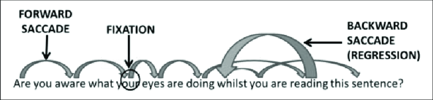

It must've happened that you have read a big volume of some very important and or influential material and then after a few days or sometimes hours you don't remember what even was there in that book. 

Books on their own can be beautiful and aesthetic but it is the content that matters the most when it comes to books or other literary material like obituaries and essays. To remember what was there in the book or what was the macro subject of the material is an important skill that few people excell in.

There is a not so small body of work dedicated to studying how to effectively accumulate knowledge and use it to your advantage especially when it comes to books. The body of literature in particular that I myself am very inspired by is Tony Buzan's Use your Head. I would recommend it to anybody regardless of his love for reading .

The book itself is focused not only on reading but on studying and learning as a whole. One part of which is happens to be reading books and remembering them. It is not a magic trick or a shortcut it's instead a well defined stratergy a method which you can use to your advantage.

Regardless of what framework or method you apply for yourself, a well defined method or framework on its own is a giant improvement from casual reading to reading so that you can apply and retain the knowledge. I would thus also like the readers to brainstorm their own methods or frameworks regardless of whether they like the one mentioned here or not.

## Some Tools to improve your Reading

Here, I will list some tools or activites that will drastically improve your reading and retaining capability.

### 1. Practicing Speed Reading

Reading faster creates extra concentration and simulation while reading some material, reading slower on the other hand creates boredom and loss of concentration. Also the fact that while reading faster you can take into account the same amount of material in a relatively less amount of time without losing any material makes it a valuable ability to master.

**How to Read Faster?**

To understand how to read faster, we have to understand how our eyes work while reading.

The untrained eye while reading a sentence tends to flow forward reading one word at a time. The time taken for the eye to move and focus on another word is non-negligible and hence decreases the flow of our reading also *tires our eyes eventually*.

The trained eye however can read multiple words or even sentences or paragraphs at once and hence offers a less tiring and more concentrated and simulating experience. You can train to do so and improve your reading speed with trying to focus on groups of words and lines instead of words. And use the help of the web in doing so. 

### 2. Filtering Key words 

It is often in our study of an academic subject that we have to note down important facts and concepts. Which seem to take a lot of time in noting down and much more effort in remembering. How about instead of doing that we remember a few key words that we can relate to a whole conceptual or non-conceptual statement. 

In almost any story that you read or material that you finish there will be a few words which will stand out as the ethos, the theme of the story it maybe a moral lesson ,a mathematical or logical statement or a simple fact.

You can filter them out and connect them to form **mind maps**. Which are graphical charts or maps that contain key words linked together forming the skeleton of a story. 

These maps can be used to note a lot of information in lesser amount of space and time and they can be easily memorised as well.

### 3. Predetermining the content and the amount of time

Instead of reading casually if you predetermine the amount of time you are going to take and the amount of content that you are going to cover, then you are likely to remember more of what you read.

Also without reading serially (from the start to the end), you can skim through most chapters and decide which one to study in detail this will drastically decrease the amount of time that you would waste reading what you didn't have to read something which deserved nothing but a skim through it.

You can also occasionally skip some sections which you find very hard or un readable. Through more knowledge and connections that it has associated with it through the later sections you can come back and find that the section will now become much easier and sensical.

### 4. Ask questions and annotate the book

You can also try to scribble and draw along the margins of the book something which is relevant to the matter of the text. For example you can paraphrase or summarise the words of the author in your own words or you can write if you've read something connected to the words of the author.
You can write your own first thoughts as you read it and then annotate your first thoughts the second time you read it.

Such actions will increase your bonding with the book itself in other words it will become more alive and less of a burden to read and throw away.

## More things to learn

You can further explore more of the art of learning and reading books and articles with these works

1. Make it Stick: The Science of Successful Learning
2. Use your Head
3. Mind Mapping: Improve Memory, Concentration...
4. How to Read, How to write
5. How to Read a Book

Cover Image by *Charles Spencylah*

...*To Be Continued*